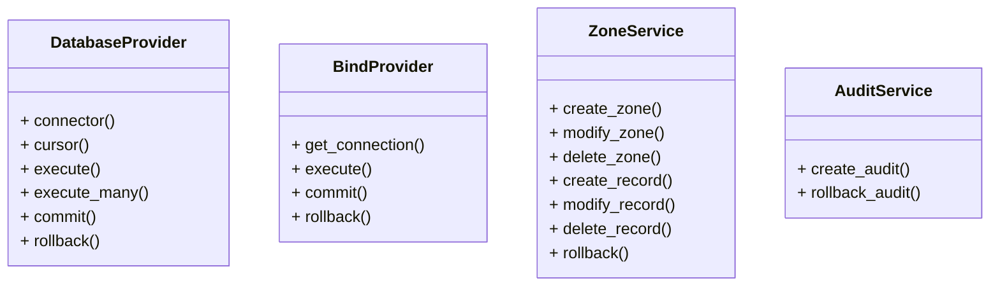

## System Components
### python fastapi
Create, modify, and delete DNS zones and records that are stored in the database and served by the bind server.

All changes are audited, and rollbacks are supported for all changes.

**Classes:**

Providers: 
- DatabaseProvider
  - Provides access to the database with psycopg2
- BindProvider
  - Provides access to the bind server with rndc (python-rndc)

Services:
- ZoneService
  - Create, modify, and delete zones and records. Saved in database, served by bind server.
  - Supports rollbacks.
- AuditService
  - Track changes to zones and records. Saved in database.

Class diagram:

### postgresql database
Stores DNS zones and records.
### bind server
Serves DNS zones and records from the database. Controlled by the python fastapi server using rndc.

